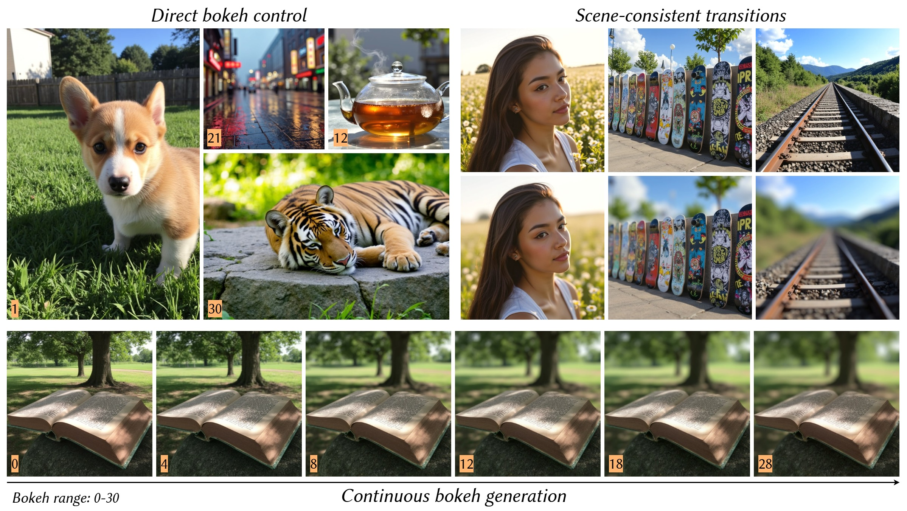

<div align="center">

<h1><i>Bokeh Diffusion</i>: Defocus Blur Control in Text-to-Image Diffusion Models</h1>

**[Armando Fortes](https://atfortes.github.io/) &emsp; [Tianyi Wei](https://scholar.google.com/citations?user=-wfXmM4AAAAJ&hl=en) &emsp; [Shangchen Zhou](https://shangchenzhou.com) &emsp; [Xingang Pan](https://xingangpan.github.io)**

**S-lab, Nanyang Technological University**

[](https://atfortes.github.io/projects/bokeh-diffusion/)
[](https://arxiv.org/abs/2503.08434)
[](https://huggingface.co/datasets/atfortes/BokehDiffusion)
[](https://huggingface.co/atfortes/BokehDiffusion)

***SIGGRAPH Asia 2025***

---

**Bokeh Diffusion enables precise, scene-consistent bokeh transitions in text-to-image diffusion models**



🎥 For more visual results, check out our <a href="https://atfortes.github.io/projects/bokeh-diffusion/">***project page***</a>.

</div>

## 📮 Update
- [2025.09] The model checkpoint and inference code are released.
- [2025.08] Bokeh Diffusion is conditionally accepted at SIGGRAPH Asia 2025! 😄🎉
- [2025.03] This repo is created.

## 🚧 TODO
- [X] Release Dataset
- [X] Release Model Weights
- [X] Release Inference Code
- [ ] Release Training Code

## ⚙️ Installation
Our environment has been tested on CUDA 12.6.
```
git clone https://github.com/atfortes/BokehDiffusion.git
cd BokehDiffusion

conda create -n bokehdiffusion -c conda-forge python=3.10
conda activate bokehdiffusion
pip install torch==2.6.0 torchvision==0.21.0 torchaudio==2.6.0 --index-url https://download.pytorch.org/whl/cu126
pip install flash-attn==2.7.4.post1 --no-build-isolation
pip install -r requirements.txt
```

## 💡 Quick Start
Unbounded image generation from text and bokeh level input:
```
python inference_flux.py \
    --prompt "a well-loved book lies forgotten on a park bench beneath a towering tree, its pages gently ruffling in the wind" \
    --bokeh_target 15.0
```
Grounded image generation for scene-consistency:
```
python inference_flux.py \
    --prompt "a well-loved book lies forgotten on a park bench beneath a towering tree, its pages gently ruffling in the wind" \
    --bokeh_target 0.0 4.0 8.0 12.0 18.0 28.0 \
    --bokeh_pivot 15.0 \
    --num_grounding_steps 24
```

Refer to the inference script for further input options (*e.g., seed, inference steps, guidance scale*).

## 📑 Citation

If you find our work useful, please cite the following paper:

```bibtex
@article{fortes2025bokeh,
    title     = {Bokeh Diffusion: Defocus Blur Control in Text-to-Image Diffusion Models},
    author    = {Fortes, Armando and Wei, Tianyi and Zhou, Shangchen and Pan, Xingang},
    journal   = {arXiv preprint arXiv:2503.08434},
    year      = {2025},
}
```

## ©️ License

This project is licensed under [NTU S-Lab License 1.0](https://github.com/atfortes/BokehDiffusion/blob/main/LICENSE). Redistribution and use should follow this license.

## 🤝 Acknowledgements

We would like to thank the following projects that made this work possible:

- [Megalith-10M](https://huggingface.co/datasets/madebyollin/megalith-10m) is used as the base dataset for collecting real in-the-wild photographs.
- [BokehMe](https://github.com/lucidrains/diffusion-models) provides the synthetic blur rendering engine for generating defocus augmentations.
- [Depth-Pro](https://github.com/apple/ml-depth-pro) is used to estimate metric depth maps.
- [RMBG v2.0](https://huggingface.co/briaai/RMBG-2.0) is used to generate foreground masks.
- [FLUX](https://github.com/black-forest-labs/flux) & [Realistic-Vision](https://huggingface.co/SG161222/Realistic\_Vision\_V5.1\_noVAE) & [Cyber-Realistic](https://huggingface.co/cyberdelia/CyberRealistic) are used as the base models for generating the samples in the paper.
