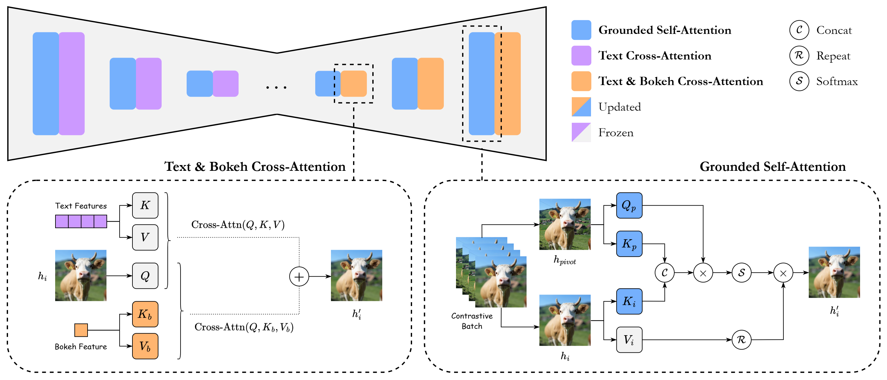

<div align="center">

<h1>Bokeh Diffusion: Defocus Blur Control in Text-to-Image Diffusion Models</h1>

**[Armando Fortes](https://atfortes.github.io/) &emsp; [Tianyi Wei](https://scholar.google.com/citations?user=-wfXmM4AAAAJ&hl=en) &emsp; [Shangchen Zhou](https://shangchenzhou.com) &emsp; [Xingang Pan](https://xingangpan.github.io)**

S-lab, Nanyang Technological University  

<div>
    <h4 align="center">
        <a href="https://atfortes.github.io/projects/bokeh-diffusion/" target='_blank'>
        
        </a>
        <a href="https://arxiv.org/abs/2503.08434" target='_blank'>
        
        </a>
<!--          -->
    </h4>
</div>

**Bokeh Diffusion enables precise, scene-consistent bokeh transitions in text-to-image diffusion models**


🎥 For more visual results, check out our <a href="https://atfortes.github.io/projects/bokeh-diffusion/" target="_blank">project page</a>

🚀✨🚧 We are working hard on releasing the code... 🔧🛠️💻 Stay tuned! 🚧✨🚀

</div>

## 📮 Update
- [2025.03] This repo is created.

## 🚧 TODO
- [ ] Release Dataset
- [ ] Release Model Weights
- [ ] Release Inference Code
- [ ] Release Training Code

## 🔎 Overview

Bokeh Diffusion combines three key components to produce lens-like bokeh without altering scene structure:

**(1) Hybrid Dataset Pipeline:** We merge real in-the-wild images (for realistic bokeh and diversity) with synthetic blur augmentations (for constrastive pairs). This approach anchors defocus realism while ensuring robust examples for training.


**(2) Defocus Blur Conditioning:** We inject a physically interpretable blur parameter (ranging from **0** to **30**) via decoupled cross-attention.

**(3) Grounded Self-Attention:** We designate a “pivot” image to anchor scene layout, ensuring consistent object placement across different blur levels. This prevents unintended content shifts when adjusting defocus.



## 📑 Citation

If you find our work useful, please cite the following paper:

```bibtex
@article{fortes2025bokeh,
    title     = {Bokeh Diffusion: Defocus Blur Control in Text-to-Image Diffusion Models},
    author    = {Fortes, Armando and Wei, Tianyi and Zhou, Shangchen and Pan, Xingang},
    journal   = {arXiv preprint arXiv:2503.08434},
    year      = {2025},
}
```

## 🤝 Acknowledgements

We would like to thank the following projects that made this work possible:

- [Megalith-10M](https://huggingface.co/datasets/madebyollin/megalith-10m) is used as the base dataset for collecting real in-the-wild photographs.
- [BokehMe](https://github.com/lucidrains/diffusion-models) provides the synthetic blur rendering engine for generating defocus augmentations.
- [Depth-Pro](https://github.com/apple/ml-depth-pro) is used to estimate metric depth maps.
- [RMBG v2.0](https://huggingface.co/briaai/RMBG-2.0) is used to generate foreground masks.
- [Realistic-Vision](https://huggingface.co/SG161222/Realistic\_Vision\_V5.1\_noVAE) & [Cyber-Realistic](https://huggingface.co/cyberdelia/CyberRealistic) are used as the base models for generating the samples in the paper.
